# Agent Orchestration Plan

## X4 Foundations AI Assistant Development

**Version:** 1.0.0  
**Last Updated:** 2026-02-02

---

## Overview

This document defines the agent orchestration strategy for developing the X4 Foundations AI Assistant. It establishes clear personas, workflows, checkpoints, and guardrails to ensure consistent, high-quality development across all phases.

---

## Task Tracking with Beads

This project uses **bd (beads)** for distributed, git-backed issue tracking optimized for AI agents.

### Quick Reference

| Command | Action |
|---------|--------|
| `bd ready` | List tasks with no open blockers |
| `bd create "Title" -p 0` | Create a P0 task |
| `bd show <id>` | View task details and audit trail |
| `bd close <id>` | Complete work |
| `bd sync` | Sync with git (run at session end) |
| `bd dep add <child> <parent>` | Link tasks (blocks, related, parent-child) |

### Agent Session Workflow

1. **Start Session:** Run `bd ready` to find unblocked work
2. **During Work:** Create sub-issues as needed with `bd create`
3. **End Session:** Run `bd sync` to persist all changes to git

### Hierarchy & Workflow

Beads supports hierarchical IDs for epics:

- `bd-a3f8` (Epic)
- `bd-a3f8.1` (Task)
- `bd-a3f8.1.1` (Sub-task)

For detailed instructions, see [Beads Documentation](https://github.com/steveyegge/beads).

---

## 1. Agent Personas

### 1.1 Research Agent

**Primary Goal:** Gather comprehensive context and information to inform design and implementation decisions.

**Capabilities:**

- Query external documentation sources
- Analyze existing codebases and APIs
- Research best practices and patterns
- Discover technical specifications
- Identify dependencies and requirements

**Tools:**

- Web search and documentation access
- GitHub repository exploration
- API documentation parsers
- Technical specification analyzers

**Input:** Task description with knowledge gaps identified  
**Output:** Context package with gathered information, source references, and recommendations

**Quality Criteria:**

- Information is accurate and from authoritative sources
- Context is comprehensive yet focused on task needs
- Sources are documented for verification
- Recommendations are actionable

---

### 1.2 Architect Agent

**Primary Goal:** Design robust, scalable solutions that align with project architecture and best practices.

**Capabilities:**

- System design and component architecture
- Interface and contract definition
- Data flow and state management planning
- Technology stack selection
- Performance and security design considerations

**Tools:**

- Architecture diagramming (Mermaid)
- Design pattern libraries
- Code structure planning
- Dependency analysis

**Input:** Context package from Research Agent + task requirements  
**Output:** Technical specification with architecture diagrams, component designs, and implementation guidance

**Quality Criteria:**

- Design aligns with project architecture
- Interfaces are well-defined and typed
- Performance implications considered
- Security best practices applied
- Design is reviewable and documented

---

### 1.3 Implementation Agent

**Primary Goal:** Write clean, tested, production-ready code that implements the designed solution.

**Capabilities:**

- Write TypeScript/JavaScript code
- Create React components
- Implement MCP tools and handlers
- Write unit and integration tests
- Handle error cases and edge conditions

**Tools:**

- Code editors and IDEs
- Testing frameworks (Vitest)
- Linters and formatters
- Type checkers

**Input:** Technical specification from Architect Agent  
**Output:** Production code with tests, following project standards

**Quality Criteria:**

- Code passes all linting checks
- TypeScript strict mode compliance
- Test coverage meets requirements (80%+)
- Error handling is comprehensive
- Code is documented where needed

---

### 1.4 Validation Agent

**Primary Goal:** Ensure all code meets quality standards and acceptance criteria before integration.

**Capabilities:**

- Execute test suites
- Run static analysis tools
- Perform integration testing
- Security vulnerability scanning
- Performance benchmarking

**Tools:**

- Test runners (Vitest, Jest)
- Linters (ESLint)
- Type checkers (TypeScript)
- Security scanners (CodeQL)
- Performance profilers

**Input:** Code changes from Implementation Agent  
**Output:** Validation report with pass/fail status and any issues found

**Quality Criteria:**

- All tests pass
- No linting or type errors
- No security vulnerabilities
- Performance within acceptable ranges
- Acceptance criteria verified

---

### 1.5 Documentation Agent

**Primary Goal:** Maintain comprehensive, up-to-date documentation for all project aspects.

**Capabilities:**

- Write and update API documentation
- Maintain architecture documentation
- Create user guides and tutorials
- Update PRD and technical specs
- Document breaking changes

**Tools:**

- Markdown editors
- Documentation generators (TypeDoc)
- Diagram tools (Mermaid)
- Style guides

**Input:** Validated code and implementation details  
**Output:** Updated documentation in appropriate locations

**Quality Criteria:**

- Documentation is accurate and complete
- Examples are working and tested
- Diagrams are up-to-date
- Breaking changes are highlighted
- User-facing docs are clear and helpful

---

## 2. Orchestration Loop

### 2.1 Main Workflow

```mermaid
flowchart TD
    Start([New Development Task]) --> Intake

    Intake[Task Intake<br/>Parse Requirements] --> Research

    Research[🔍 Research Agent<br/>Gather Context] --> ResearchReview{Context<br/>Sufficient?}

    ResearchReview -->|No - Missing Info| Research
    ResearchReview -->|Yes| Architect

    Architect[📐 Architect Agent<br/>Design Solution] --> ArchReview{Design<br/>Approved?}

    ArchReview -->|No - Needs Revision| Architect
    ArchReview -->|Blocked - Need More Context| Research
    ArchReview -->|Yes| Implement

    Implement[💻 Implementation Agent<br/>Write Code + Tests] --> ImplReview{Code<br/>Complete?}

    ImplReview -->|No - Continue| Implement
    ImplReview -->|Blocked - Design Issue| Architect
    ImplReview -->|Yes| Validate

    Validate[✅ Validation Agent<br/>Run All Tests] --> ValidReview{All Checks<br/>Pass?}

    ValidReview -->|No - Tests Fail| Implement
    ValidReview -->|No - Design Flaw| Architect
    ValidReview -->|Yes| Document

    Document[📝 Documentation Agent<br/>Update Docs] --> DocReview{Docs<br/>Complete?}

    DocReview -->|No - Incomplete| Document
    DocReview -->|Yes| Checkpoint

    Checkpoint[🎯 Phase Checkpoints] --> CP1[Validation<br/>Checkpoint]
    CP1 --> CP2[Alignment<br/>Checkpoint]
    CP2 --> CP3[Documentation<br/>Checkpoint]

    CP3 --> FinalReview{All<br/>Checkpoints<br/>Pass?}

    FinalReview -->|No - Issues Found| Research
    FinalReview -->|Yes| Done

    Done([✓ Task Complete<br/>Ready for Integration])

    style Research fill:#e1f5ff
    style Architect fill:#fff4e1
    style Implement fill:#e8f5e1
    style Validate fill:#ffe1f5
    style Document fill:#f5e1ff
    style Checkpoint fill:#ffe6e6
    style Done fill:#90EE90
```



### 2.2 Workflow Stages

#### Stage 1: Research & Context Gathering

**Agent:** Research Agent  
**Objectives:**

- Understand task requirements completely
- Gather all necessary technical context
- Identify dependencies and constraints
- Research best practices and patterns

**Deliverables:**

- Context package document
- Reference links and citations
- Technical constraints list
- Recommended approaches

**Exit Criteria:**

- All knowledge gaps filled
- Sources documented
- Architect has sufficient information to design

---

#### Stage 2: Architecture & Design

**Agent:** Architect Agent  
**Objectives:**

- Design component structure
- Define interfaces and contracts
- Plan data flows
- Consider performance and security

**Deliverables:**

- Technical specification document
- Architecture diagrams (Mermaid)
- Interface definitions (TypeScript)
- Implementation guidance

**Exit Criteria:**

- Design reviewed and approved
- All components defined
- Dependencies identified
- Implementation path clear

---

#### Stage 3: Implementation

**Agent:** Implementation Agent  
**Objectives:**

- Write production code
- Create comprehensive tests
- Handle error cases
- Follow project standards

**Deliverables:**

- Production code
- Unit tests
- Integration tests
- Inline documentation

**Exit Criteria:**

- Code compiles without errors
- All tests written
- Error handling complete
- Ready for validation

---

#### Stage 4: Validation

**Agent:** Validation Agent  
**Objectives:**

- Run all automated tests
- Verify acceptance criteria
- Check for security issues
- Validate performance

**Deliverables:**

- Test execution report
- Code coverage report
- Security scan results
- Performance benchmarks

**Exit Criteria:**

- All tests pass
- Coverage meets threshold (80%+)
- No security vulnerabilities
- Performance acceptable

---

#### Stage 5: Documentation

**Agent:** Documentation Agent  
**Objectives:**

- Update API reference
- Refresh architecture docs
- Document new features
- Update PRD if needed

**Deliverables:**

- Updated documentation files
- API reference updates
- User guide additions
- Architecture diagram updates

**Exit Criteria:**

- All documentation current
- Examples tested and working
- Breaking changes documented
- Ready for checkpoint review

---

#### Stage 6: Phase Checkpoints

**All Agents:** Collaborative review  
**Objectives:**

- Validate against acceptance criteria
- Ensure alignment with PRD
- Confirm documentation completeness
- Verify readiness for integration

**Checkpoints:**

1. **Validation Checkpoint:** All tests pass, no errors
2. **Alignment Checkpoint:** Meets PRD objectives, stakeholder approval
3. **Documentation Checkpoint:** Docs complete and accurate

**Exit Criteria:**

- All three checkpoints passed
- No blockers or issues
- Ready for merge

---

## 3. Research Loops

### 3.1 Structured Research Process


### 3.2 Research Sources by Domain

#### X4 Foundations Game Data

- **Primary:** X4 Foundations Wiki
- **Secondary:** Community forums, Reddit r/X4Foundations
- **Code:** X4 REST Server repository
- **API:** X4 REST Server API documentation

#### MCP Protocol

- **Primary:** MCP specification documentation
- **Secondary:** Anthropic's MCP examples
- **Code:** Reference implementations

#### TypeScript/React Development

- **Primary:** Official TypeScript and React docs
- **Secondary:** Best practice guides
- **Code:** High-quality open source examples

#### Vercel AI SDK

- **Primary:** Vercel AI SDK documentation
- **Secondary:** Example applications
- **Code:** SDK source code and examples

#### Security & Performance

- **Primary:** OWASP guidelines
- **Secondary:** Node.js security best practices
- **Code:** Security linting rules

### 3.3 Context Package Template

Each research output should include:

```markdown
# Context Package: [Topic]

## Summary

[Brief overview of findings]

## Key Information

- Point 1
- Point 2
- ...

## Technical Constraints

- Constraint 1
- Constraint 2

## Recommendations

- Recommendation 1
- Recommendation 2

## Sources

- [Source 1 with URL]
- [Source 2 with URL]

## Open Questions

- Question 1
- Question 2
```

---

## 4. Explicit Checkpoints

### 4.1 Validation Checkpoint

**Trigger:** After Validation Agent completes testing  
**Scope:** Technical quality and correctness

**Checklist:**

- [ ] All automated tests pass (unit, integration, e2e)
- [ ] Code coverage meets threshold (80%+)
- [ ] Linting passes with zero errors
- [ ] TypeScript compilation successful in strict mode
- [ ] Security scan shows no critical/high vulnerabilities
- [ ] Build succeeds on all target platforms
- [ ] Performance benchmarks within acceptable ranges

**Pass Criteria:** All checklist items completed  
**Fail Action:** Return to Implementation Agent for fixes

---

### 4.2 Alignment Checkpoint

**Trigger:** After Validation Checkpoint passes  
**Scope:** Requirements and PRD alignment

**Checklist:**

- [ ] Acceptance criteria from PRD met
- [ ] Feature matches specification
- [ ] No scope creep or unplanned features
- [ ] Stakeholder demo completed (if applicable)
- [ ] User stories validated
- [ ] Risk assessment updated
- [ ] Phase objectives still on track

**Pass Criteria:** All checklist items completed  
**Fail Action:** Review with Architect Agent, possibly return to Research

---

### 4.3 Documentation Checkpoint

**Trigger:** After Alignment Checkpoint passes  
**Scope:** Documentation completeness and accuracy

**Checklist:**

- [ ] API reference updated for new/changed APIs
- [ ] Architecture diagrams reflect current state
- [ ] User-facing documentation updated
- [ ] Developer guides current
- [ ] Breaking changes documented
- [ ] PRD updated with learnings
- [ ] CHANGELOG updated (if applicable)
- [ ] Examples tested and working

**Pass Criteria:** All checklist items completed  
**Fail Action:** Documentation Agent addresses gaps

---

## 5. Guardrails

### 5.1 Quality Gates

**Code Quality:**

- TypeScript strict mode: Required
- ESLint errors: Must be zero
- Code coverage: Minimum 80%
- Complexity: Max cyclomatic complexity of 10
- File size: Max 500 lines (with exceptions)

**Testing:**

- Unit tests: All public functions
- Integration tests: All major workflows
- Error cases: All error paths tested
- Edge cases: Known edge cases covered

**Security:**

- No hardcoded secrets
- Input validation on all external data
- No critical/high vulnerabilities
- Dependencies scanned and updated
- Security headers configured

**Performance:**

- Bundle size: Monitor and limit growth
- Load time: < 3 seconds initial load
- Query latency: < 500ms (p95)
- Memory usage: No leaks detected

### 5.2 Communication Protocols

**Agent Handoffs:**

- Clear context package format
- Explicit deliverables defined
- Dependencies documented
- Blockers escalated immediately

**Feedback Loops:**

- Regular check-ins at stage boundaries
- Design reviews before implementation
- Code reviews before validation
- Documentation reviews before completion

**Escalation Path:**

1. **Agent-level:** Agent identifies blocker, passes to previous agent
2. **Stage-level:** Issue requires re-design or re-research
3. **Phase-level:** Fundamental issue requires PRD review
4. **Project-level:** Scope or timeline adjustment needed

### 5.3 Risk Management

**Dependency Risks:**

- Pin all production dependencies
- Audit dependencies weekly
- Monitor upstream changes
- Have rollback plan

**Breaking Changes:**

- Document all breaking changes
- Provide migration guides
- Version bumps follow semver
- Deprecation notices with timeline

**Performance Regression:**

- Benchmark before/after changes
- Profile critical paths
- Load testing for major features
- Rollback if regression > 10%

**Security Vulnerabilities:**

- Immediate patching for critical issues
- Security review for sensitive code
- Regular dependency updates
- Incident response plan

### 5.4 Development Standards

**Code Style:**

- Follow project ESLint/Prettier config
- Consistent naming conventions
- Meaningful variable names
- Comments for complex logic only

**Git Workflow:**

- Feature branches from main
- Descriptive commit messages
- Small, focused commits
- Rebase before merge (if appropriate)

**Testing Standards:**

- AAA pattern (Arrange, Act, Assert)
- Descriptive test names
- One assertion per test (generally)
- Mock external dependencies

**Documentation Standards:**

- API docs for all public APIs
- README for each package
- Architecture decisions recorded (ADRs if needed)
- Runnable examples included

---

## 6. Iteration & Feedback

### 6.1 Continuous Improvement

Each completed task should include a brief retrospective:

**What Worked Well:**

- Effective agent handoffs
- Clear specifications
- Good test coverage

**What Could Improve:**

- Missing context early on
- Design iteration needed
- Documentation gaps

**Action Items:**

- Update agent prompts
- Enhance context gathering
- Improve templates

### 6.2 PRD Updates

The PRD should be updated after each phase with:

- Actual vs. planned timelines
- Lessons learned
- Architectural changes
- Updated risk assessments
- Revised future phases

---

## 7. Tool & Resource Access

### 7.1 Available Spaces

Agents have access to specialized Spaces for context gathering:

**X4 Foundations Space:**

- Game mechanics documentation
- API references
- Community best practices

**MCP/Agent Development Space:**

- MCP protocol specifications
- Agent orchestration patterns
- Tool implementation examples

**Vercel AI SDK Space:**

- AI SDK documentation
- Integration patterns
- React/UI components

**Usage:** Agents should leverage Spaces proactively during research phase.

### 7.2 Development Tools

**Required:**

- Node.js 18+
- pnpm 8+
- TypeScript 5+
- Git

**Recommended:**

- VS Code with extensions (ESLint, Prettier, TypeScript)
- GitHub Copilot
- Browser DevTools

---

## 8. Example Workflow: Implementing a New MCP Tool

### Step-by-Step Orchestration

1. **Research Phase**
   - Research Agent gathers: X4 REST API endpoints for the tool, MCP tool definition patterns, similar tool examples
   - Output: Context package with API details, best practices, implementation approach

2. **Architecture Phase**
   - Architect Agent designs: Tool interface, parameter schema, return types, error handling, integration points
   - Output: Technical spec with TypeScript interfaces, data flow diagram

3. **Implementation Phase**
   - Implementation Agent creates: Tool handler function, parameter validators, error handling, unit tests, integration tests
   - Output: Working code with comprehensive tests

4. **Validation Phase**
   - Validation Agent runs: Unit tests, integration tests, linting, type checking, security scan
   - Output: Validation report confirming all checks pass

5. **Documentation Phase**
   - Documentation Agent updates: API reference with new tool, usage examples, troubleshooting guide, PRD tool count
   - Output: Complete documentation updates

6. **Checkpoint Review**
   - Validation Checkpoint: All tests pass ✓
   - Alignment Checkpoint: Meets PRD Phase 2 objectives ✓
   - Documentation Checkpoint: API docs complete ✓
   - **Result:** Ready for integration

---

## 9. Troubleshooting

### Common Issues & Solutions

**Issue:** Research Agent cannot find sufficient information  
**Solution:** Expand source list, consult alternative docs, prototype to learn

**Issue:** Architect design rejected in review  
**Solution:** Loop back with feedback, gather additional context if needed

**Issue:** Implementation tests fail repeatedly  
**Solution:** Review design, check for edge cases, validate test correctness

**Issue:** Validation finds security vulnerability  
**Solution:** Immediate fix, re-run validation, document in security log

**Issue:** Documentation incomplete or unclear  
**Solution:** Review with Implementation Agent for clarification, add examples

---

## 10. Document Maintenance

This document should be:

- Reviewed after each major phase
- Updated with process improvements
- Kept in sync with PRD
- Referenced in all agent prompts

**Next Review:** End of Phase 1 (2026-02-09)

---

## 11. Quick Reference

### Agent Summary

- 🔍 **Research:** Gather context and information
- 📐 **Architect:** Design solutions and architecture
- 💻 **Implementation:** Write code and tests
- ✅ **Validation:** Verify quality and correctness
- 📝 **Documentation:** Maintain docs and guides

### Checkpoint Summary

1. **Validation:** Tests pass, no errors
2. **Alignment:** Meets requirements, stakeholder approval
3. **Documentation:** Docs complete and accurate

### Quick Wins

- Start with Research Agent for new features
- Use Architect Agent for complex designs
- Implementation Agent follows specs strictly
- Validation Agent catches issues early
- Documentation Agent keeps everything current

---

**Document Version:** 1.0.0  
**Last Updated:** 2026-02-02  
**Maintained By:** Development Team
