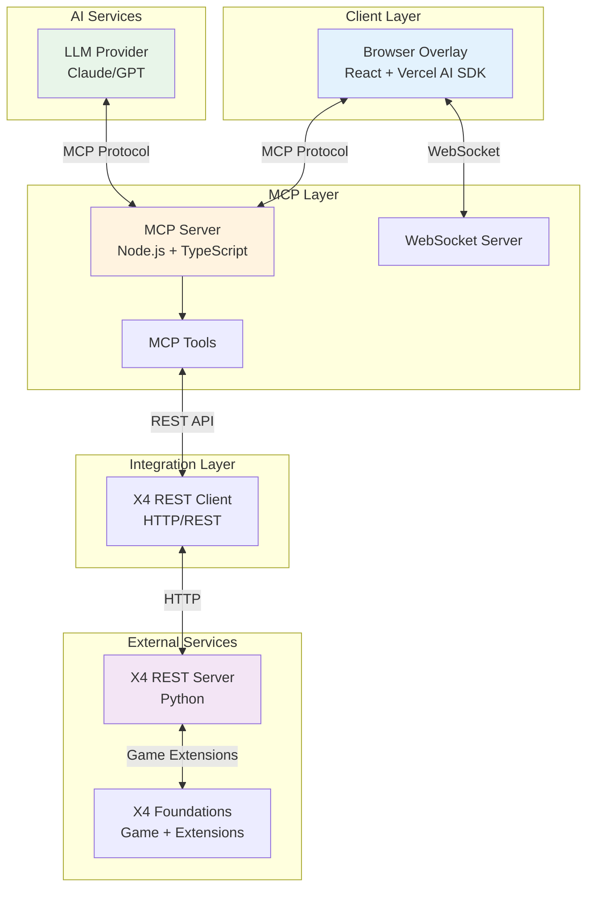
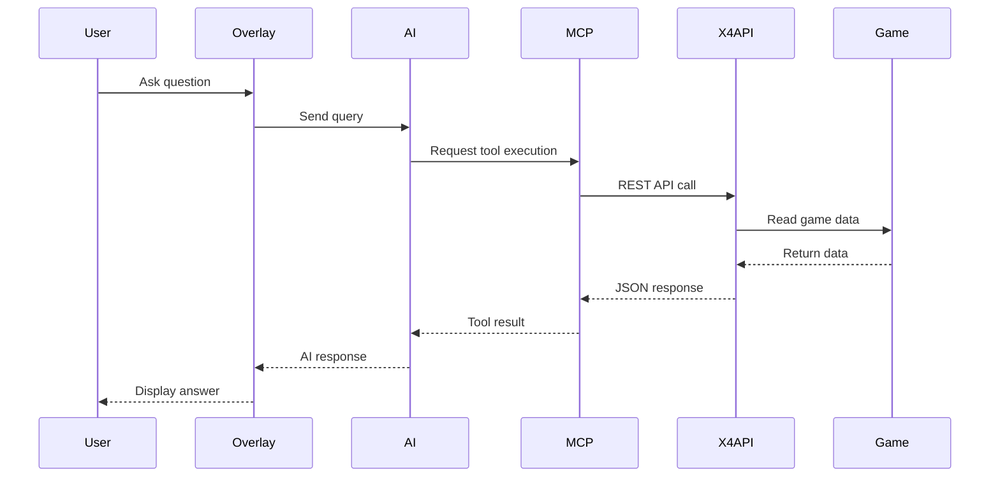

# Architecture Documentation
## X4 Foundations AI Assistant

**Version:** 1.0.0  
**Status:** Work in Progress  
**Last Updated:** 2026-02-02

---

## Overview

This document describes the architecture of the X4 Foundations AI Assistant, including system components, data flows, and technical decisions.

---

## System Architecture

### High-Level Component Diagram

---

## Component Details

### Browser Overlay (To Be Implemented - Phase 3)

**Technology:** React, TypeScript, Vercel AI SDK  
**Purpose:** In-game user interface for AI interaction

**Responsibilities:**
- Render overlay UI in browser
- Handle user input and commands
- Display real-time game data
- Manage AI chat interface
- WebSocket connection to MCP server

**Key Files:** (To be created in Phase 3)
- `packages/overlay/src/App.tsx`
- `packages/overlay/src/components/`
- `packages/overlay/src/hooks/`

---

### MCP Server (To Be Implemented - Phase 2)

**Technology:** Node.js, TypeScript  
**Purpose:** Bridge between AI and game data

**Responsibilities:**
- Implement MCP protocol
- Define and handle tools
- Connect to X4 REST API
- Manage WebSocket connections
- Cache and optimize data access

**Key Files:** (To be created in Phase 2)
- `packages/mcp-server/src/server.ts`
- `packages/mcp-server/src/tools/`
- `packages/mcp-server/src/client/`

---

### X4 REST Server (External Dependency)

**Technology:** Python  
**Source:** https://github.com/Alia5/X4-rest-server  
**Purpose:** Expose X4 game data via REST API

**Integration:**
- Added as Git submodule in `vendor/x4-rest-server`
- Runs independently as Python service
- Accessed via HTTP REST API

---

## Data Flow

### Query Flow

---

## Technology Decisions

### Monorepo Structure
**Decision:** Use pnpm workspaces  
**Rationale:**
- Single repo for all packages
- Shared dependencies
- Consistent tooling
- Easy cross-package development

**Alternatives Considered:** Separate repos, Yarn workspaces

---

### TypeScript
**Decision:** Use TypeScript in strict mode  
**Rationale:**
- Type safety reduces bugs
- Better IDE support
- Self-documenting code
- Required for MCP SDK

**Configuration:** See `tsconfig.base.json`

---

### MCP Protocol
**Decision:** Use Model Context Protocol  
**Rationale:**
- Standard for AI-tool communication
- Supports multiple AI providers
- Well-documented protocol
- Growing ecosystem

**Alternatives Considered:** Custom protocol, direct API integration

---

### React for Overlay
**Decision:** Use React with Vercel AI SDK  
**Rationale:**
- Large ecosystem
- Vercel AI SDK integration
- Component reusability
- Strong TypeScript support

**Alternatives Considered:** Vue, Svelte, vanilla JS

---

## Security Considerations

### Authentication
- X4 REST Server authentication (TBD)
- MCP server access control (TBD)
- Overlay origin validation (TBD)

### Data Protection
- No sensitive data in logs
- Environment variables for secrets
- HTTPS for production

### Input Validation
- Validate all external inputs
- Sanitize user queries
- Rate limiting on API calls

---

## Performance Considerations

### Caching Strategy
- Cache X4 REST responses
- TTL-based invalidation
- Memory-efficient storage

### Connection Management
- WebSocket keep-alive
- Connection pooling for REST
- Graceful degradation

### Optimization Goals
- Query latency < 500ms (p95)
- Overlay render < 3s initial
- Memory usage < 200MB

---

## Deployment Architecture

### Development
- Local X4 REST Server
- Local MCP Server
- Local Overlay (dev server)

### Production (Future)
- Containerized services
- Cloud deployment options
- CDN for overlay assets

---

## Future Enhancements

### Scalability
- Multi-player support
- Distributed caching
- Load balancing

### Extensibility
- Plugin system
- Custom tool development
- Theme customization

---

## Open Questions

- [ ] Authentication mechanism for X4 REST Server?
- [ ] Deployment model (local vs. cloud)?
- [ ] Multi-game support architecture?
- [ ] Plugin API design?

---

## References

- [PRD Document](./PRD.md)
- [Agent Orchestration](../AGENTS.md)
- [X4 REST Server](https://github.com/Alia5/X4-rest-server)
- [MCP Specification](https://modelcontextprotocol.io/)

---

**Note:** This document will be expanded during Phase 2 and Phase 3 as implementation progresses.

---

**Next Update:** End of Phase 2 (MCP Server implementation)
