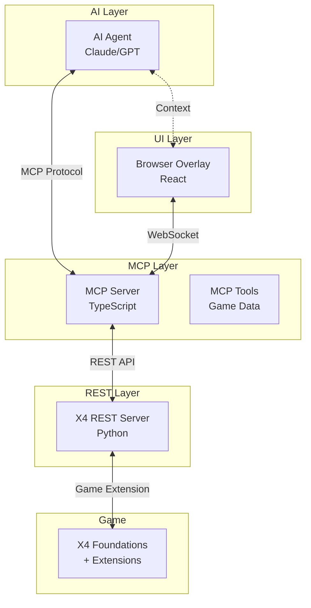
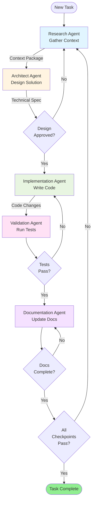

# Product Requirements Document (PRD)
## X4 Foundations AI Assistant

**Version:** 1.0.0  
**Status:** Living Document  
**Last Updated:** 2026-02-02

---

## 1. Project Overview

### 1.1 Vision
Create an AI-powered assistant that enhances X4 Foundations gameplay through real-time data access, intelligent automation, and interactive overlay capabilities.

### 1.2 Goals
- Provide real-time access to X4 game data via MCP (Model Context Protocol)
- Enable natural language interactions for game queries and automation
- Build an in-game overlay for visual feedback and controls
- Support modding and extensibility through plugin architecture
- Maintain performance with minimal game impact

### 1.3 Non-Goals
- Game modification or cheating capabilities
- Competitive advantage features
- Replacement for official game tools
- Support for other X4 community tools integration (Phase 1)

---

## 2. Architecture Overview

### 2.1 System Components

### 2.2 Technology Stack
- **MCP Server:** TypeScript, Node.js
- **Overlay UI:** React, TypeScript, Vercel AI SDK
- **X4 REST Server:** Python (external submodule)
- **Build System:** pnpm workspaces, Turborepo
- **Testing:** Vitest, Testing Library
- **CI/CD:** GitHub Actions

---

## 3. Development Phases

### Phase 1: Foundation (Current)
**Objective:** Establish monorepo structure and core documentation

**Deliverables:**
- Monorepo scaffolding with pnpm workspaces
- Living PRD and agent orchestration docs
- Package structure for MCP server and overlay
- CI/CD pipeline stubs
- Development environment setup

**Success Criteria:**
- ✅ All documentation files in place
- ✅ Build system configured
- ✅ CI/CD pipeline runs successfully
- ✅ Clear agent orchestration documented

### Phase 2: MCP Server Core
**Objective:** Implement basic MCP server with X4 REST integration

**Deliverables:**
- MCP server skeleton with protocol handlers
- Connection to X4 REST Server
- Basic tools: get player info, station data, ship data
- Authentication and error handling
- Unit and integration tests

**Success Criteria:**
- MCP server connects to X4 REST API
- At least 5 functional tools implemented
- 80%+ test coverage
- Documentation for all tools

### Phase 3: Overlay Foundation
**Objective:** Create browser-based overlay with basic UI

**Deliverables:**
- React overlay application
- WebSocket connection to MCP server
- Basic UI components (status display, command input)
- Vercel AI SDK integration
- Theming system

**Success Criteria:**
- Overlay renders in browser
- Real-time data display works
- AI chat interface functional
- Responsive design implemented

### Phase 4: Advanced Features
**Objective:** Add automation and advanced querying

**Deliverables:**
- Advanced MCP tools (fleet management, trade routes)
- Automation workflows
- Plugin system design
- Performance optimization
- Comprehensive error handling

**Success Criteria:**
- Complex queries handled efficiently
- Automation reduces manual tasks
- Plugin architecture documented
- Performance targets met

### Phase 5: Polish & Release
**Objective:** Prepare for public release

**Deliverables:**
- Complete user documentation
- Installation guides
- Video tutorials
- Community feedback integration
- Security audit

**Success Criteria:**
- Beta testing completed
- All critical bugs resolved
- Documentation comprehensive
- Release packages created

---

## 4. Phase Checkpoints

Each phase includes three critical checkpoints:

### 4.1 Validation Checkpoint
- Run all automated tests (lint, typecheck, unit, integration)
- Verify build artifacts
- Test deployment process
- Performance benchmarking

### 4.2 Alignment Checkpoint
- Review against PRD objectives
- Stakeholder demo and feedback
- User story validation
- Risk assessment update

### 4.3 Documentation Checkpoint
- Update API reference
- Refresh architecture diagrams
- Update this PRD with learnings
- Create/update developer guides
- Document breaking changes

---

## 5. Agent Personas & Orchestration

### 5.1 Agent Personas

#### Research Agent
**Role:** Information gathering and context discovery  
**Responsibilities:**
- Query external documentation (X4 Wiki, REST API docs)
- Gather MCP best practices
- Research Vercel AI SDK patterns
- Collect technical specifications

#### Architect Agent
**Role:** System design and structure planning  
**Responsibilities:**
- Design component architecture
- Plan data flows
- Define interfaces and contracts
- Create technical specifications

#### Implementation Agent
**Role:** Code development and testing  
**Responsibilities:**
- Write production code
- Create unit tests
- Implement features per spec
- Handle code reviews

#### Validation Agent
**Role:** Quality assurance and verification  
**Responsibilities:**
- Run test suites
- Perform integration testing
- Validate against acceptance criteria
- Security scanning

#### Documentation Agent
**Role:** Technical writing and updates  
**Responsibilities:**
- Maintain API documentation
- Update architecture docs
- Create user guides
- Keep PRD current

### 5.2 Agent Orchestration Loop

### 5.3 Research Loops

#### Context Gathering Process
1. **Initial Discovery:** Identify knowledge gaps and required information
2. **Source Identification:** Determine authoritative sources (docs, APIs, code)
3. **Information Extraction:** Query and extract relevant details
4. **Synthesis:** Combine information into actionable context
5. **Validation:** Verify accuracy and completeness
6. **Package:** Format for consumption by downstream agents

#### Research Sources
- X4 Foundations Wiki and community documentation
- X4 REST Server repository and API docs
- MCP protocol specification
- Vercel AI SDK documentation
- TypeScript/React best practices
- Security guidelines (OWASP, etc.)

### 5.4 Guardrails

#### Quality Gates
- Code coverage minimum: 80%
- TypeScript strict mode required
- ESLint errors must be zero
- Security vulnerabilities: none critical/high
- Build must succeed on all platforms

#### Communication Protocols
- Clear handoffs between agents with context packages
- Feedback loops for alignment issues
- Escalation path for blockers
- Regular checkpoint reviews

#### Risk Management
- Dependency vulnerability scanning
- Breaking change documentation
- Rollback procedures defined
- Performance regression testing

---

## 6. Acceptance Criteria

### Phase 1 (Foundation)
- [x] Monorepo structure created with pnpm workspaces
- [x] Documentation framework established (PRD, AGENTS.md, etc.)
- [x] CI/CD pipeline configured
- [x] Git submodule for X4 REST Server added
- [x] Developer environment setup documented

### Phase 2 (MCP Server)
- [ ] MCP server responds to protocol handshake
- [ ] At least 5 tools implemented and tested
- [ ] Connection to X4 REST Server established
- [ ] Error handling for common scenarios
- [ ] API documentation complete

### Phase 3 (Overlay)
- [ ] Overlay renders in browser
- [ ] WebSocket connection established
- [ ] Chat interface with AI functional
- [ ] Real-time data display working
- [ ] Basic theming applied

### Phase 4 (Advanced)
- [ ] Advanced automation tools working
- [ ] Plugin architecture implemented
- [ ] Performance targets met (< 100ms latency)
- [ ] Complex queries handled efficiently

### Phase 5 (Release)
- [ ] Beta testing completed with 10+ users
- [ ] All critical/high bugs resolved
- [ ] User documentation complete
- [ ] Installation process validated

---

## 7. Phase Status Tracking

| Phase | Status | Start Date | Target Date | Completion Date | Notes |
|-------|--------|------------|-------------|-----------------|-------|
| Phase 1: Foundation | 🟡 In Progress | 2026-02-02 | 2026-02-09 | - | Scaffolding and docs |
| Phase 2: MCP Server | ⚪ Not Started | 2026-02-10 | 2026-02-28 | - | Core server implementation |
| Phase 3: Overlay | ⚪ Not Started | 2026-03-01 | 2026-03-21 | - | UI development |
| Phase 4: Advanced | ⚪ Not Started | 2026-03-22 | 2026-04-15 | - | Advanced features |
| Phase 5: Release | ⚪ Not Started | 2026-04-16 | 2026-05-01 | - | Polish and launch |

**Legend:**
- ⚪ Not Started
- 🟡 In Progress
- 🟢 Complete
- 🔴 Blocked
- ⚠️ At Risk

---

## 8. Risks & Mitigations

| Risk | Impact | Probability | Mitigation |
|------|--------|-------------|------------|
| X4 REST Server API changes | High | Medium | Pin to specific version, monitor upstream |
| MCP protocol evolution | Medium | Low | Follow spec closely, design for flexibility |
| Performance bottlenecks | Medium | Medium | Early benchmarking, profiling tools |
| Security vulnerabilities | High | Medium | Regular scanning, security reviews |
| Scope creep | Medium | High | Strict phase boundaries, PRD enforcement |

---

## 9. Success Metrics

### Development Metrics
- Build time: < 2 minutes
- Test execution: < 30 seconds
- Code coverage: > 80%
- TypeScript strict: 100%

### User Metrics (Post-Launch)
- Installation success rate: > 95%
- Crash rate: < 1%
- Query response time: < 500ms (p95)
- User satisfaction: > 4.0/5.0

### Community Metrics
- GitHub stars growth
- Issue response time: < 48 hours
- PR review time: < 72 hours
- Active contributors

---

## 10. Future Considerations

### Post-Phase 5 Enhancements
- Multi-player support exploration
- Mobile companion app
- Voice command integration
- Advanced analytics and statistics
- Community plugin marketplace

### Integration Opportunities
- Other X4 community tools
- Streaming integration (Twitch, YouTube)
- Discord bot companion
- Save game analyzer

---

## 11. Glossary

- **MCP:** Model Context Protocol - standard for AI-tool communication
- **X4 REST Server:** Python-based REST API for X4 game data access
- **Overlay:** Browser-based UI layer for in-game interaction
- **Agent:** Specialized AI persona for specific development tasks
- **Checkpoint:** Validation gate between development stages

---

## 12. Document History

| Version | Date | Author | Changes |
|---------|------|--------|---------|
| 1.0.0 | 2026-02-02 | Copilot Agent | Initial PRD creation |

---

**Next Review:** 2026-02-09 (End of Phase 1)
